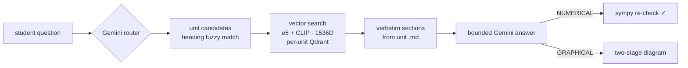

#  Wildflow
**Ask your syllabus anything.** Wildflow is a multimodal RAG study app that answers *only* from your college's official unit notes — the exact formulas, the exact diagrams, nothing hallucinated from the model's pretraining.

Built around the architecture described in the preprint **[Wildflow: A Multimodal Retrieval-Augmented Academic Intelligence System](docs/wildflow-preprint.pdf)** (Rohan Deogaonkar, MIT World Peace University, 2026).

▶ **[Live demo page](https://rohanbeingsocial.github.io/wildflow/)**


## Why

Conventional RAG reduces hallucination but doesn't eliminate it, because the LLM is still free to blend retrieved content with its internal pretrained knowledge. The preprint identifies four failure modes of standard RAG in academic settings:

- **No equation validation** — formulas are embedded as ordinary text, so retrieval can surface truncated equations with missing symbols, and nothing checks completeness.
- **Weak image–topic connection** — multimodal systems embed text and images jointly, but an image that is *semantically* similar may not belong to the section being answered.
- **Prompt-based hallucination control** — "only use the retrieved context" instructions are soft; the model can still mix in its own knowledge because nothing in the architecture stops it.
- **No awareness of academic structure** — flattened chunks lose lecture titles, topic headers, and unit boundaries, so retrieval mixes content across units.

For exam prep that's poison: you need *your professor's* derivation, *your unit's* notation, *your syllabus's* boundaries. Wildflow's answer is architectural rather than prompt-based — structured Markdown as the single source of truth, one isolated vector store per unit, and an LLM confined to classification, bounded generation, and verification.

## How this came to be

I built Wildflow during my **first year of engineering** at MIT World Peace University, from January to April 2025 — my first attempt at architecting an end-to-end system: structured data pipelines, vector databases, multi-model orchestration, and cost-aware scalability planning. I paused the project in April 2025 for academic commitments; the design decisions and trade-offs I made along the way are documented publicly on my [Medium](https://medium.com/@rohandeogaonkar.9). I later consolidated the research prototype (a pile of ~15 scripts) into the two-file product in this repo, and wrote the architecture up as the preprint.

Several ambitions I deliberately deferred (GPU capital and API-cost constraints during early scaling): per-subject fine-tuned small language models, a fully local model stack, voice-driven study modes, auto-generated study guides, and a semantically linked resource library of past papers. The architecture is modular precisely so these can bolt on without a redesign.

## Design principles

Four rules from the preprint govern how knowledge flows through the system:

1. **Markdown is the authoritative source.** The structured Markdown generated from institutional PDFs is the definitive reference. The LLM may not override, reinterpret, or extend beyond it unless a controlled fallback is explicitly triggered.
2. **The LLM is a verifier, not a knowledge author.** Its roles are limited to query classification, topic extraction, logical validation of retrieved content, and step-by-step numerical solving — never open-ended recall.
3. **Deterministic topic routing.** Subject and unit are identified *before* retrieval; there is no global similarity search across all indexed data. Structured JSON mappings restrict the search scope to one academic unit.
4. **Unit-level knowledge isolation.** Every unit gets its own Markdown file, its own vector database, and its own metadata, so semantically similar topics in different units can never interfere. Containment is structural, not post-hoc.

## What the student sees

No subject menus, no unit pickers. Pick your college + year once, then just type:

1. **Auto-routing** — a Gemini call classifies subject, core topic, and query type (THEORY / NUMERICAL / GRAPHICAL); topic-to-heading fuzzy matching nominates candidate units; vector search inside those units settles it. If the router's quota is exhausted, a local classifier takes over.
2. **Verbatim retrieval** — matched sections are re-read from the unit's `.md` file, so equations (KaTeX) and diagrams arrive intact. Answers cite the exact section headings they came from, with a **view-source toggle** showing the raw notes.
3. **Verification** — numerical answers are re-checked with sympy and get a "✓ arithmetic verified" chip (or a "⚠ check arithmetic" warning with the computed value).
4. **Extras** — per-unit 📐 formula sheet, 🎯 practice-quiz generator, section-diagram gallery, 👍/👎 feedback logging, and a semantic answer cache (cosine ≥ 0.95 within a unit) so repeat questions are instant.

## Architecture



The full pipeline described in the preprint runs: **PDF → OCR + structured parsing → Markdown (text + KaTeX + image refs) → text-only embedding → unit-wise Qdrant → query-to-topic detection → targeted unit retrieval → Markdown cross-verification → LLM final verification → verified output.**

### From PDF to Markdown

Institutional PDFs are processed with the **Surya OCR** model — not flattened to plain text, but reconstructed: topics, subtopics, equations, and figures keep their contextual relationships, and a fixed heading-depth convention encodes lecture title / topic / points / sub-points so chunking stays topic-aware. During extraction the system also identifies the subject (title pages, header keywords, recurring terminology) and files the output into a strict hierarchy:

```
CollegeName/ → YearOfStudy/ → Subject/ → Unit/
                                          ├── unit.md        # authoritative structured Markdown
                                          ├── qdrant_db/     # unit-local vector store
                                          ├── images/        # extracted diagrams
                                          └── unit metadata  # topic mapping + paths
```

That OCR stage happens offline, before this repo enters the picture — `embed.py` and `app.py` consume the resulting Markdown ("bring your own Markdown").

### Dual storage: authority layer vs. search layer

Every unit is stored twice, on purpose. The **Markdown layer** keeps the complete hierarchy, KaTeX equations, and image references — the source of truth. The **vector layer** holds only cleaned text segments in a unit-local Qdrant collection, each tagged with a structured payload:

```json
{ "topic": "Number-Average Molecular Mass", "unit": "Chemistry Unit1", "source": "unit1.md" }
```

so every retrieved vector can be traced to its exact Markdown source, verified in its unit context, and reconstructed with its equations and images. Metadata also enables hybrid search — semantic similarity constrained by subject/unit/topic filters.

### Text-only embedding policy

Before embedding, KaTeX blocks and image references are stripped. Dense symbolic math behaves unpredictably in text embedding spaces — formulas processed as ordinary tokens skew similarity scores, and file paths carry no conceptual meaning. Excluding them keeps the vector space semantically clean; the equations and images aren't lost, they're re-attached from the Markdown layer at retrieval time and verified for completeness before display.

**Vector recipe** (this implementation, stable across rebuilds so old unit DBs keep working): `intfloat/multilingual-e5-large` (1024D) concatenated with CLIP ViT-B/32 text (512D) → 1536D, cosine distance, one Qdrant store per unit. The preprint prototype used `nomic-ai/nomic-embed-text-v1`; the consolidated version upgraded to the e5+CLIP pair.

## Retrieval: one model per job

Wildflow never sends every query to one big model. Models are selected by query type to balance accuracy against cost:

| Stage | Model class | Job |
|---|---|---|
| Query detection | lightweight | classify subject, extract topic, tag THEORY / NUMERICAL / GRAPHICAL — fast, minimal tokens |
| Theory answers | lightweight | explanation bounded strictly to retrieved Markdown content |
| Numerical answers | advanced | step-by-step symbolic/numeric computation, invoked only when needed |
| Graphical queries | two-stage | an instruction model decomposes the drawing into ordered geometric steps, then an image model renders them — reasoning separated from rendering |

The preprint prototype pinned specific models (`gemini-2.0-flash` for routing/theory, `gemini-2.5-pro-exp-03-25` for math); this implementation addresses them by **rolling aliases** (`gemini-flash-latest`, `gemini-pro-latest`) with per-model quota-fallback chains, so the app doesn't break when Google retires a version or a free-tier bucket empties.

Verified answers are also cached short-term: identical or near-identical questions (cosine ≥ 0.95 within a unit) are served from cache instead of re-invoking the pipeline, cutting API cost and latency while staying consistent with the authoritative dataset.

## Verification framework

Retrieval results are never shown directly — they pass four checks between retrieval and response:

1. **Topic consistency** — the retrieved segment must match the topic detected at classification; a mismatch triggers a mandatory re-query within the correct scope rather than surfacing a weak match.
2. **Equation integrity** — formulas must be complete (symbols, summations, operators intact) and byte-match their Markdown original; partial or truncated equations are discarded.
3. **Image–topic alignment** — a referenced diagram must belong to the same topic, live in the correct unit directory, and match the path in the Markdown file.
4. **Logical coherence** — a final LLM pass confirms the response doesn't contradict the source material, even when vector similarity looked fine.

Fallback to the model's own knowledge happens only under defined conditions (nothing relevant in the database, incomplete retrieval, query outside syllabus coverage) — and even then, the response explicitly labels what came from the database versus the model.

## Numerical reasoning

Numerical queries get their own pipeline: **formula-first**. The system retrieves the relevant formula from the Markdown source *before* any solving, guaranteeing the institutional formulation is used rather than whatever variant the model remembers from pretraining. Values are substituted and solved step by step, each intermediate step shown, and the output is constrained to given values → substitution → steps → final answer (no essay padding). In this implementation the arithmetic is then re-computed with **sympy** and chip-marked verified or flagged.

## Does it work?

The preprint evaluates Wildflow on Engineering Mechanics and Engineering Chemistry questions scored 0–4 against ground-truth answers from official lecture materials, including a head-to-head against a baseline Gemini 2.5 Flash given the same documents but no structured retrieval, routing, or verification:

| Metric | Wildflow | Baseline Gemini |
|---|---|---|
| Subject accuracy | **100%** | 85% |
| Topic accuracy | 85% | 70–90% (subject-dependent) |
| Numerical validity | 80–90% | 70–90% |
| Hallucination rate | **1–3%** | 20–25% |

The headline finding: structured RAG doesn't necessarily beat a strong LLM at topic identification, but it dramatically improves reliability, numerical correctness, and hallucination control — the properties that matter when a wrong formula costs you exam marks. One retrieval that scored well below the similarity threshold (32 vs. threshold 60) was still answered correctly because the verification layer caught and re-queried it. (Small evaluation set — 13 primary questions, n=40 comparative — so read these as directional.)

## The whole product is two scripts

| File | Who runs it | What it does |
|---|---|---|
| `embed.py` | Admin, manually | Builds/rebuilds the vector DB inside a unit folder |
| `app.py` | Students (the product) | Auto-routing retrieval engine + web server |
| `static/index.html` | (served by `app.py`) | React chat UI — history, live pipeline animation, KaTeX |

## Quickstart

```bash
pip install -r requirements.txt

# required — the app refuses Gemini calls without it
set GEMINI_API_KEY=your_key_here          # PowerShell: $env:GEMINI_API_KEY="..."

# point at your content root (folder of college/year/subject/unit folders)
set WILDFLOW_CONTENT_ROOT=C:\path\to\your\markdown\units

python app.py
# open http://127.0.0.1:8000
```

Each unit folder contains one `.md` file (the authoritative notes, images referenced by relative path) and a `qdrant_db/` built by:

```bash
python embed.py "C:\path\to\Unit 3_Nanomaterials"
```

First question after startup loads the embedding models (~4–6 GB free RAM needed — close Docker/WSL if you hit "paging file too small"; the app checks and tells you instead of crashing). To let classmates on your Wi-Fi use it: `set WILDFLOW_HOST=0.0.0.0`, share `http://<your-ip>:8000`.

> **Note:** course content is *not* included in this repo — lecture notes belong to their authors. Bring your own Markdown.

## API

| Endpoint | Purpose |
|---|---|
| `GET /api/meta` | colleges, years, subjects, unit counts |
| `POST /api/route` | `{message, college, year}` → subject, unit candidates, query type |
| `POST /api/answer` | `{message, unit_ids, query_type, history}` → answer, sources, gallery, verify, cached |
| `GET /api/formulas?u=` | every display equation in a unit, grouped by topic |
| `POST /api/quiz` | 5-question practice quiz from unit content |
| `POST /api/feedback` | 👍/👎 logging (JSONL) |
| `GET /api/media?u=&f=` | serves unit diagrams |

## Limitations

Straight from the preprint, because honesty is cheaper than support tickets:

- **Markdown quality is load-bearing.** OCR inaccuracies, inconsistent formatting, or missing heading markers in the source PDFs degrade the structured hierarchy that routing and retrieval depend on.
- **Domain-specific by design.** Built for structured engineering curricula; new academic domains may need adjusted parsing rules, topic-detection heuristics, and prompts.
- **JSON routing dependency.** Query routing rests on auto-generated topic→unit metadata; if topic extraction during preprocessing is wrong, routing precision drops.
- **Deliberately syllabus-scoped.** Wildflow answers from institutional material only — it is not, and does not want to be, an open-domain assistant.

## Citation

```bibtex
@article{deogaonkar2026wildflow,
  title  = {Wildflow: A Multimodal Retrieval-Augmented Academic Intelligence System},
  author = {Deogaonkar, Rohan},
  year   = {2026},
  note   = {Preprint},
  url    = {https://github.com/rohanbeingsocial/wildflow}
}
```

Development notes and design write-ups from the build: [medium.com/@rohandeogaonkar.9](https://medium.com/@rohandeogaonkar.9)
