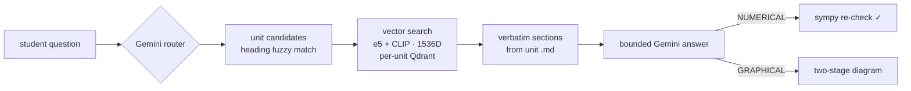

# 🌸 Wildflow — syllabus-true study AI

**Ask your syllabus anything.** Wildflow is a multimodal RAG study app that answers *only* from your college's official unit notes — the exact formulas, the exact diagrams, nothing hallucinated from the model's pretraining.

Built around the architecture described in the preprint **[Wildflow: A Multimodal Retrieval-Augmented Academic Intelligence System](docs/wildflow-preprint.pdf)** (Rohan Deogaonkar, MIT World Peace University, 2026).

▶ **[Live demo page](https://rohanbeingsocial.github.io/wildflow/)** · 🎬 [MP4 (60 fps)](docs/demo.mp4)


## Why

Conventional RAG reduces hallucination but still lets the LLM blend retrieved content with its internal knowledge. For exam prep that's poison: you need *your professor's* derivation, *your unit's* notation, *your syllabus's* boundaries. Wildflow treats structured Markdown exported from official lecture PDFs as the **single source of truth**, keeps every unit in an **isolated vector store**, and restricts the LLM to classification, bounded generation, and verification.

## What the student sees

No subject menus, no unit pickers. Pick your college + year once, then just type:

1. **Auto-routing** — a Gemini call classifies subject, core topic, and query type (THEORY / NUMERICAL / GRAPHICAL); topic-to-heading fuzzy matching nominates candidate units; vector search inside those units settles it. If the router's quota is exhausted, a local classifier takes over.
2. **Verbatim retrieval** — matched sections are re-read from the unit's `.md` file, so equations (KaTeX) and diagrams arrive intact. Answers cite the exact section headings they came from, with a **view-source toggle** showing the raw notes.
3. **Verification** — numerical answers are re-checked with sympy and get a "✓ arithmetic verified" chip (or a "⚠ check arithmetic" warning with the computed value).
4. **Extras** — per-unit 📐 formula sheet, 🎯 practice-quiz generator, section-diagram gallery, 👍/👎 feedback logging, and a semantic answer cache (cosine ≥ 0.95 within a unit) so repeat questions are instant.



## The whole product is two scripts

| File | Who runs it | What it does |
|---|---|---|
| `embed.py` | Admin, manually | Builds/rebuilds the vector DB inside a unit folder |
| `app.py` | Students (the product) | Auto-routing retrieval engine + web server |
| `static/index.html` | (served by `app.py`) | React chat UI — history, live pipeline animation, KaTeX |

**Vector recipe** (stable across rebuilds, so old unit DBs keep working): `intfloat/multilingual-e5-large` (1024D) concatenated with CLIP ViT-B/32 text (512D) → 1536D, cosine distance, one Qdrant store per unit.

## Quickstart

```bash
pip install -r requirements.txt

# required — the app refuses Gemini calls without it
set GEMINI_API_KEY=your_key_here          # PowerShell: $env:GEMINI_API_KEY="..."

# point at your content root (folder of college/year/subject/unit folders)
set WILDFLOW_CONTENT_ROOT=C:\path\to\your\markdown\units

python app.py
# open http://127.0.0.1:8000
```

Each unit folder contains one `.md` file (the authoritative notes, images referenced by relative path) and a `qdrant_db/` built by:

```bash
python embed.py "C:\path\to\Unit 3_Nanomaterials"
```

First question after startup loads the embedding models (~4–6 GB free RAM needed — close Docker/WSL if you hit "paging file too small"; the app checks and tells you instead of crashing). To let classmates on your Wi-Fi use it: `set WILDFLOW_HOST=0.0.0.0`, share `http://<your-ip>:8000`.

> **Note:** course content is *not* included in this repo — lecture notes belong to their authors. Bring your own Markdown.

## API

| Endpoint | Purpose |
|---|---|
| `GET /api/meta` | colleges, years, subjects, unit counts |
| `POST /api/route` | `{message, college, year}` → subject, unit candidates, query type |
| `POST /api/answer` | `{message, unit_ids, query_type, history}` → answer, sources, gallery, verify, cached |
| `GET /api/formulas?u=` | every display equation in a unit, grouped by topic |
| `POST /api/quiz` | 5-question practice quiz from unit content |
| `POST /api/feedback` | 👍/👎 logging (JSONL) |
| `GET /api/media?u=&f=` | serves unit diagrams |

Gemini models are addressed by **rolling aliases** (`gemini-flash-latest`, `gemini-pro-latest`) with per-model quota-fallback chains, so the app doesn't break when Google retires a version or a free-tier bucket empties.

## Can this run on GitHub Pages?

No — Pages hosts static files only, and Wildflow needs a Python backend, ~2.5 GB of embedding models, per-unit vector stores, and a server-side Gemini key. The [Pages site](https://rohanbeingsocial.github.io/wildflow/) hosts the demo; to actually run Wildflow you need any box with Python and ~6 GB of free RAM (a small VPS works).

## Citation

```bibtex
@article{deogaonkar2026wildflow,
  title  = {Wildflow: A Multimodal Retrieval-Augmented Academic Intelligence System},
  author = {Deogaonkar, Rohan},
  year   = {2026},
  note   = {Preprint},
  url    = {https://github.com/rohanbeingsocial/wildflow}
}
```
